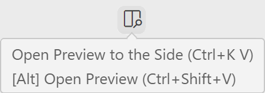

# [Stretch Programs](.)

## Installation Instructions

Welcome to the Stretch Programs repository! This repository contains various coding exercises and assignments designed to help you improve your programming skills.

## Prerequisites

Before you begin, ensure you have access to the following:

[ Terminal](https://apps.microsoft.com/detail/9n0dx20hk701?hl=en-US&gl=US)

## Setting Up Your Environment

### Installing Visual Studio Code

[Install Visual Studio Code from the Microsoft Store.](https://apps.microsoft.com/detail/XP9KHM4BK9FZ7Q?hl=en-US&gl=US&ocid=pdpshare)

## Exploring the Repository

3. Open this repository in VS Code:

### Option 1:

* Open VS Code
  - Navigate the menu bar or press `Ctrl-K Ctrl-O` to `Open Folder...`
  - Navigate to the `stretch-programs-main` folder and open it.

### Option 2: (This way is pretty fun)

* In File Explorer: 

  - Right Click on the background to open the context menu for this folder.
  - Select `Open in Terminal`
  - Enter the following command in the terminal:

```Powershell
# Open Visual Studio Code in the folder "." AKA the 'current directory'
code . 
```

## Once you have this folder open in VS Code:

**PRO TIP: In VS Code Open this README preview by opening the file `README.md` and then pressing: `Ctrl-Shift-V`**

A more straightforward way to open this preview (or if the shortcut above doesn't work) is to use VS Code's built-in markdown preview feature. Just click on the icon with the magnifying class and window panes, found near the top-right of the active editor.

<div style="width: 200px;">
  
</div><br>

Another useful tip is to set the preferences within vs code:

1. Use the **Preferences: Open Settings (UI)** command to open the settings UI.
2. Provide instructions to search for "`workbench.startupEditor`" in the settings search bar.
3. Use the **`workbench.startupEditor`** setting to control which editor is shown at startup. Set it to `readme` to open README files by default.

```
{
  "workbench.startupEditor": "readme"
}
```

## In this Folder

***Navigate to the subfolders in this repository*** for more detailed instructions:

- Individual component installation instructions.
- Assignments and exercises.

***Under Development***
### [C++ README](cpp/README.md)
### [JavaScript README](js/README.md)
### [Python README](python/README.md)
### [Java README](java/README.md)

***TBD***
### [C# README](cs/README.md)
### [SQL README](sqlite/README.md)
### [Go README](go/README.md)
### [Ruby README](ruby/README.md)
