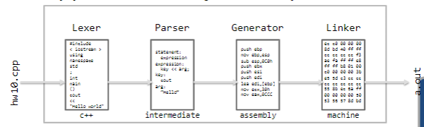

# Unit 1. Simple Programs

## Table of Contents
<table class="table-of-contents" style="
    width: calc(100% - 40px);
    max-width: 500px;
    margin: 20px 20px;">
<tbody>
  <tr>
    <td style="white-space: nowrap" style="
    /* border: 1px solid blue; */
    vertical-align: middle;
    padding: 0px;
    text-align: left;
    border: none;">
      <a href="../1.0-First-Program/README.md">
      <p style="
        /* border: 1px solid green; */
        position: relative;
        top: .5em;">
      1.0 First Program&nbsp;.................................................................................................................
      </p>
      </a>
    </td>
    <td class="page-number" style="
      /* border: 1px solid blue; */
      vertical-align: middle;
      padding: 0px;
      text-align: left;
      border: none;
      position: relative;
      top: 0;"><p style="
    /* border: 1px solid green; */
    position: relative;
    top: .5em;">13</p></td>
  </tr>
  <tr>
    <td style="white-space: nowrap" style="
    /* border: 1px solid blue; */
    vertical-align: middle;
    padding: 0px;
    text-align: left;
    border: none;">
      <a href="../1.1-Output/README.md">
      <p style="
      /* border: 1px solid green; */
      position: relative;
      top: .5em;">
      1.1 Output&nbsp;.............................................................................................................................
      </p>
      </a>
    </td>
    <td style="
    /* border: 1px solid blue; */
    vertical-align: middle;
    padding: 0px;
    text-align: left;
    border: none;"><p style="
      /* border: 1px solid green; */
      position: relative;
      top: .5em;">24</p></td>
  </tr>
  <tr>
    <td style="white-space: nowrap" style="
    /* border: 1px solid blue; */
    vertical-align: middle;
    padding: 0px;
    text-align: left;
    border: none;">
      <a href="../1.2-Input-&-Variables/README.md">
      <p style="
      /* border: 1px solid green; */
      position: relative;
      top: .5em;">
      1.2 Input & Variables&nbsp;...........................................................................................................
      </p>
      </a>
    </td>
    <td style="
    /* border: 1px solid blue; */
    vertical-align: middle;
    padding: 0px;
    text-align: left;
    border: none;"><p class="page-number" style="
      /* border: 1px solid green; */
      position: relative;
      top: .5em;
      position: relative;
      top: 0;">35</p></td>
  </tr>
  <tr>
    <td style="white-space: nowrap" style="
    /* border: 1px solid blue; */
    vertical-align: middle;
    padding: 0px;
    text-align: left;
    border: none;">
      <a href="../1.3-Expressions/README.md">
      <p style="
      /* border: 1px solid green; */
      position: relative;
      top: .5em;">
      1.3 Expressions&nbsp;....................................................................................................................
      </p>
      </a>
    </td>
    <td style="
    /* border: 1px solid blue; */
    vertical-align: middle;
    padding: 0px;
    text-align: left;
    border: none;"><p style="
      /* border: 1px solid green; */
      position: relative;
      top: .5em;">46</p></td>
  </tr>
  <tr>
    <td style="white-space: nowrap" style="
    /* border: 1px solid blue; */
    vertical-align: middle;
    padding: 0px;
    text-align: left;
    border: none;">
      <a href="../1.4-Functions/README.md">
      <p style="
      /* border: 1px solid green; */
      position: relative;
      top: .5em;">
      1.4 Functions&nbsp;.......................................................................................................................
      </p>
      </a>
    </td>
    <td style="
    /* border: 1px solid blue; */
    vertical-align: middle;
    padding: 0px;
    text-align: left;
    border: none;"><p class="page-number" style="
      /* border: 1px solid green; */
      position: relative;
      top: .5em;
      position: relative;
      top: 0;">58</p></td>
  </tr>
  <tr>
    <td style="white-space: nowrap" style="
    /* border: 1px solid blue; */
    vertical-align: middle;
    padding: 0px;
    text-align: left;
    border: none;">
      <a href="../1.5-Boolean-Expressions/README.md">
      <p style="
      /* border: 1px solid green; */
      position: relative;
      top: .5em;">
      1.5 Boolean Expressions&nbsp;......................................................................................................
      </p>
      </a>
    </td>
    <td style="
    /* border: 1px solid blue; */
    vertical-align: middle;
    padding: 0px;
    text-align: left;
    border: none;"><p class="page-number" style="
      /* border: 1px solid green; */
      position: relative;
      top: .5em;
      position: relative;
      top: 0;">76</p></td>
  </tr>
  <tr>
    <td style="white-space: nowrap" style="
    /* border: 1px solid blue; */
    vertical-align: middle;
    padding: 0px;
    text-align: left;
    border: none;">
      <a href="../1.6-IF-Statements/README.md">
      <p style="
      /* border: 1px solid green; */
      position: relative;
      top: .5em;">
      1.6 IF Statements&nbsp;.................................................................................................................
      </p>
      </a>
    </td>
    <td style="
    /* border: 1px solid blue; */
    vertical-align: middle;
    padding: 0px;
    text-align: left;
    border: none;"><p class="page-number" style="
      /* border: 1px solid green; */
      position: relative;
      top: .5em;
      position: relative;
      top: 0;">86</p></td>
  </tr>
  <tr>
    <td style="white-space: nowrap" style="
    /* border: 1px solid blue; */
    vertical-align: middle;
    padding: 0px;
    text-align: left;
    border: none;">
      <a href="../1.7-Unit-1-Practice-Test/README.md">
      <p style="
      /* border: 1px solid green; */
      position: relative;
      top: .5em;">
      Unit 1 Practice Test&nbsp;..............................................................................................................
      </p>
      </a>
    </td>
    <td style="
    /* border: 1px solid blue; */
    vertical-align: middle;
    padding: 0px;
    text-align: left;
    border: none;"><p class="page-number" style="
      /* border: 1px solid green; */
      position: relative;
      top: .5em;
      position: relative;
      top: 0;">99</p></td>
  </tr>
  <tr>
    <td style="white-space: nowrap" style="
    /* border: 1px solid blue; */
    vertical-align: middle;
    padding: 0px;
    text-align: left;
    border: none;">
      <a href="../1.8-Unit-1-Project-Monthly-Budget/README.md">
      <p style="
      /* border: 1px solid green; */
      position: relative;
      top: .5em;">
      Unit 1 Project : Monthly Budget&nbsp;.....................................................................................
      </p>
      </a>
    </td>
    <td style="
    /* border: 1px solid blue; */
    vertical-align: middle;
    padding: 0px;
    text-align: left;
    border: none;"><p class="page-number" style="
      /* border: 1px solid green; */
      position: relative;
      top: .5em;
      position: relative;
      top: 0;">101</p></td>
  </tr>
</tbody>
</table>

<p class="footer left" style="
  text-align: left;
  font-size: .75em;">
<br>
<br>
<br>
<br>
<br>
Procedural Programming in C++ &nbsp;&nbsp;&nbsp;|&nbsp;&nbsp;&nbsp;
Unit 1: Simple Programs &nbsp;&nbsp;&nbsp;|&nbsp;&nbsp;&nbsp;
1.0 First Program &nbsp;&nbsp;&nbsp;|&nbsp;&nbsp;&nbsp;
<strong>Page 12</strong>
</p>

<div style="page-break-after: always;"></div>

## 1.0 First Program

Sue is home for the Christmas holiday when her mother asks her to fix a "computer problem."
It turns out that the problem is not the computer itself, but some data their bank has sent them.
Instead of e-mailing a list of stock prices in US dollars ($), the entire list is in Euros (€)!
Rather than perform the conversion by hand, Sue decides to write a program to do the conversion.
Without referencing any books (they are back in her apartment) or any of her previous programs (also back in her apartment), she quickly writes the code to complete the task.

### Objectives

By the end of this class, you will be able to:

- Use the provided tools (Linux, emacs, g++, styleChecker, testBed, submit) to complete a homework assignment.
- Be familiar with the University coding standards (Appendix A. Elements of Style).

### Prerequisites

Before reading this section, please make sure you are able to:

- Type the code for a simple program (Chapter 0.2).

### Overview of the process

The process of turning in a homework assignment consists of several steps.
While these steps may seem unfamiliar at first, they will be well-rehearsed and second-nature in a week or two.
The lab assistants (wearing green vests in the Linux lab) are ready and eager to help you if you get stuck on the way.
The process consists of the following steps:

1. Log into the lab
2. Copy the assignment template using `cp`
3. Edit your file using `emacs`
4. Compile the program using `g++`
5. Verify your solution with `testBed`
6. Verify your style with `styleChecker`
7. Turn it in with `submit`

This entire process will be demonstrated in "Example - Hello World" at the end of the chapter.

<p class="footer right" style="
  text-align: right;
  font-size: .75em;">
<br>
<br>
<br>
<br>
<br>
Procedural Programming in C++ &nbsp;&nbsp;&nbsp;|&nbsp;&nbsp;&nbsp;
Unit 1: Simple Programs &nbsp;&nbsp;&nbsp;|&nbsp;&nbsp;&nbsp;
1.0 First Program &nbsp;&nbsp;&nbsp;|&nbsp;&nbsp;&nbsp;
<strong>Page 13</strong>
</p>

<div style="page-break-after: always;"></div>

### 0. Login

All programming assignments are done on the Linux system.
This includes the pre-class assignments, the projects, and the in-lab tests.
You can either go to the Linux Lab to use the campus computers, or connect remotely to the lab from your personal computer.
Either way, you will need to log in.
If you have not done this in Assignment 0.0, please re-visit the quiz for the default password.
The lab assistants will be able to help you reset your password if necessary.
Please see [Appendix C: Lab Help](../../Unit-5/Appendix-C/README.md) for a description of what the lab assistants can and cannot do.

It is worthwhile to set up your computer so you do not need to come to the lab to do an assignment.
The method is different for a Microsoft Windows computer than it is for an Apple Macintosh computer.

#### Remote access for Windows computers

1. Download the tool called PuTTY

<div style="text-align: center;">
  <p>
    <a href="https://www.ssh.com/academy/ssh/putty/windows">
      Setup - PuTTY
    </p>
  </a>
</div>

2. Go to the lab and read the IP address (four numbers separated by periods) from any machine in the lab.
They are 157.201.194.201 through 157.201.194.210.
This will be the physical machine you are accessing when using remote access.
3. Boot PuTTY and type in your IP address from step 2 and the port 215. You might want to save this session so you dont have to keep typing the numbers in.
4. Select [OPEN]. After you specify your username and password, you are now logged into that machine.

#### Remote access for Macintosh or Linux computers

If you are on a Macintosh or a Linux computer, bring up a terminal window and type the following command:

```
ssh <username>@<ip> -p 215
```

If, for example, you want to connect to machine 157.201.194.230 and your username is "sam", then you would type:

```
ssh sam@157.201.194.230 -p 215
```

For more information, please see: Setup - Terminal

<div style="text-align: center;">
  <p>
    <a href="https://support.apple.com/en-ie/guide/terminal/apd5265185d-f365-44cb-8b09-71a064a42125/mac">
      Setup - Terminal
    </p>
  </a>
</div>

<p class="footer left" style="
  text-align: left;
  font-size: .75em;">
<br>
<br>
<br>
<br>
<br>
Procedural Programming in C++ &nbsp;&nbsp;&nbsp;|&nbsp;&nbsp;&nbsp;
Unit 1: Simple Programs &nbsp;&nbsp;&nbsp;|&nbsp;&nbsp;&nbsp;
1.0 First Program &nbsp;&nbsp;&nbsp;|&nbsp;&nbsp;&nbsp;
<strong>Page 14</strong>
</p>

<div style="page-break-after: always;"></div>

### 1. Copy Template

Once you have successfully logged into the Linux system (either remotely or in the Linux Lab), the next step is to copy over the template for the assignment. All the assignments for this class start with a template file which has placeholders for the assignment name and the author (that would be you!). This file, and all other files pertaining to the course, can be found on:

```
/home/cs124
```

The assignment (and project and test) template is located on:

```
/home/cs124/template.cpp
```

On the Linux system, we type commands rather than use the mouse. The command used to copy a file is called "cp". The syntax for the copy command is:

```
cp <source file> <destination file>
```

If, for example, you were to copy the template from `/home/cs124/template.cpp` into `hw10.cpp`, you would type the following command:

```
cp /home/cs124/template.cpp hw10.cpp
```

Most Linux commands do not display anything on the screen if they were successful. You will need to do a directory listing (`ls`) to see if the file copied. A list of other common Linux commands are the following:

<table class="linux-commands" style="background: #a7bfde80; 
    min-width: 600px;
    margin: 0;
    padding: 0;
    border: 1px solid transparent;">
  <tbody>
    <tr class="title-row" style="
      background: #4f81bd;
      color: white;
      text-align: center;
      white-space: normal;">
      <td rowspan="10" style="
        min-width: 120px;
        padding: 5px;
        margin: 0;">
        <strong>Navigation<br>tools</strong>
      </td>
    </tr>
    <tr class="tool" style="
      margin: 0;
      padding: 0;">
      <td style="
        min-width: 50px;
        padding: 0;
        margin: 0;
        padding-left: .5em;
        white-space: nowrap;">
        <code style="color: black;">cd</code>
        <span class="monospace" style="
          padding: 0;
          margin: 0;
          font-family: Courier, monospace;">...........</span>&nbsp;
      </td>
      <td class="tool-description" style="
        min-width: 200px;
        width: 100%;
        white-space: nowrap;">Change Directory</td>
    </tr>
    <tr class="tool" style="
      margin: 0;
      padding: 0;">
      <td style="
        min-width: 50px;
        padding: 0;
        margin: 0;
        padding-left: .5em;
        white-space: nowrap;">
        <code style="color: black;">ls</code>
        <span class="monospace" style="
          padding: 0;
          margin: 0;
          font-family: Courier, monospace;">...........</span>&nbsp;
      </td>
      <td class="tool-description" style="
        min-width: 200px;
        width: 100%;
        white-space: nowrap;">List information about file(s)</td>
    </tr>
    <tr class="tool" style="
      margin: 0;
      padding: 0;">
      <td style="
        min-width: 50px;
        padding: 0;
        margin: 0;
        padding-left: .5em;
        white-space: nowrap;">
        <code style="color: black;">cat</code>
        <span class="monospace" style="
          padding: 0;
          margin: 0;
          font-family: Courier, monospace;">..........</span>&nbsp;
      </td>
      <td class="tool-description" style="
        min-width: 200px;
        width: 100%;
        white-space: nowrap;">Display the contents of a file to the screen</td>
    </tr>
    <tr class="tool" style="
      margin: 0;
      padding: 0;">
      <td style="
        min-width: 50px;
        padding: 0;
        margin: 0;
        padding-left: .5em;
        white-space: nowrap;">
        <code style="color: black;">clear</code>
        <span class="monospace" style="
          padding: 0;
          margin: 0;
          font-family: Courier, monospace;">........</span>&nbsp;
      </td>
      <td class="tool-description" style="
        min-width: 200px;
        width: 100%;
        white-space: nowrap;">Clear terminal screen</td>
    </tr>
    <tr class="tool" style="
      margin: 0;
      padding: 0;">
      <td style="
        min-width: 50px;
        padding: 0;
        margin: 0;
        padding-left: .5em;
        white-space: nowrap;">
        <code style="color: black;">exit</code>
        <span class="monospace" style="
          padding: 0;
          margin: 0;
          font-family: Courier, monospace;">.........</span>&nbsp;
      </td>
      <td class="tool-description" style="
        min-width: 200px;
        width: 100%;
        white-space: nowrap;">Exit the shell</td>
    </tr>
    <tr class="tool" style="
      margin: 0;
      padding: 0;">
      <td style="
        min-width: 50px;
        padding: 0;
        margin: 0;
        padding-left: .5em;
        white-space: nowrap;">
        <code style="color: black;">yppasswd</code>
        <span class="monospace" style="
          padding: 0;
          margin: 0;
          font-family: Courier, monospace;">.....</span>&nbsp;
      </td>
      <td class="tool-description" style="
        min-width: 200px;
        width: 100%;
        white-space: nowrap;">Modify a user password</td>
    </tr>
  </tbody>
</table>

<table class="linux-commands" style="background: #d3dfee80; 
    min-width: 600px;
    margin: 0;
    padding: 0;
    border: 1px solid transparent;">
  <tbody>
    <tr class="title-row" style="
      background: #4f81bd;
      color: white;
      text-align: center;
      white-space: normal;">
      <td rowspan="10" style="
        min-width: 120px;
        padding: 5px;
        margin: 0;">
        <strong>Organization<br>tools</strong>
      </td>
    </tr>
    <tr class="tool" style="
      margin: 0;
      padding: 0;">
      <td style="
        min-width: 50px;
        padding: 0;
        margin: 0;
        padding-left: .5em;
        white-space: nowrap;">
        <code style="color: black;">mkdir</code>
        <span class="monospace" style="
          padding: 0;
          margin: 0;
          font-family: Courier, monospace;">........</span>&nbsp;
      </td>
      <td class="tool-description" style="
        min-width: 200px;
        width: 100%;
        white-space: nowrap;">Create new folder(s)</td>
    </tr>
    <tr class="tool" style="
      margin: 0;
      padding: 0;">
      <td style="
        min-width: 50px;
        padding: 0;
        margin: 0;
        padding-left: .5em;
        white-space: nowrap;">
        <code style="color: black;">mv</code>
        <span class="monospace" style="
          padding: 0;
          margin: 0;
          font-family: Courier, monospace;">...........</span>&nbsp;
      </td>
      <td class="tool-description" style="
        min-width: 200px;
        width: 100%;
        white-space: nowrap;">Move or rename files or directories</td>
    </tr>
    <tr class="tool" style="
      margin: 0;
      padding: 0;">
      <td style="
        min-width: 50px;
        padding: 0;
        margin: 0;
        padding-left: .5em;
        white-space: nowrap;">
        <code style="color: black;">rm</code>
        <span class="monospace" style="
          padding: 0;
          margin: 0;
          font-family: Courier, monospace;">...........</span>&nbsp;
      </td>
      <td class="tool-description" style="
        min-width: 200px;
        width: 100%;
        white-space: nowrap;">Remove files</td>
    </tr>
  </tbody>
</table>

<table class="linux-commands" style="background: #a7bfde80; 
    min-width: 600px;
    margin: 0;
    padding: 0;
    border: 1px solid transparent;">
  <tbody>
    <tr class="title-row" style="
      background: #4f81bd;
      color: white;
      text-align: center;
      white-space: normal">
      <td rowspan="10" style="
        min-width: 120px;
        padding: 5px;
        margin: 0;">
        <strong>Programming<br>tools</strong>
      </td>
    </tr>
    <tr class="tool" style="
      margin: 0;
      padding: 0;">
      <td style="
        min-width: 50px;
        padding: 0;
        margin: 0;
        padding-left: .5em;
        white-space: nowrap;">
        <code style="color: black;">emacs</code>
        <span class="monospace" style="
          padding: 0;
          margin: 0;
          font-family: Courier, monospace;">........</span>&nbsp;
      </td>
      <td class="tool-description" style="
        min-width: 200px;
        width: 100%;
        white-space: nowrap;">Common code editor</td>
    </tr>
    <tr class="tool" style="
        padding: 0;
        margin: 0;
        padding-left: .5em;
        white-space: nowrap;">
      <td style="
        min-width: 50px;
        padding: 0;
        margin: 0;
        padding-left: .5em;
        white-space: nowrap;">
        <code style="color: black;">vi</code>
        <span class="monospace" style="
          padding: 0;
          margin: 0;
          font-family: Courier, monospace;">...........</span>&nbsp;
      </td>
      <td class="tool-description" style="
        min-width: 200px;
        width: 100%;
        white-space: nowrap;">More primitive but ubiquitous editor</td>
    </tr>
    <tr class="tool" style="
      margin: 0;
      padding: 0;">
      <td style="
        min-width: 50px;
        padding: 0;
        margin: 0;
        padding-left: .5em;
        white-space: nowrap;">
        <code style="color: black;">g++</code>
        <span class="monospace" style="
          padding: 0;
          margin: 0;
          font-family: Courier, monospace;">..........</span>&nbsp;
      </td>
      <td class="tool-description" style="
        min-width: 200px;
        width: 100%;
        white-space: nowrap;">Compile a C++ program</td>
    </tr>
  </tbody>
</table>

<table class="linux-commands" style="background: #d3dfee80; 
    min-width: 600px;
    margin: 0;
    padding: 0;
    border: 1px solid transparent;">
  <tbody>
    <tr class="title-row" style="
      background: #4f81bd;
      color: white;
      text-align: center;
      white-space: normal;
        min-width: 120px;
        padding: 5px;">
      <td rowspan="10" style="padding: 5px;
        min-width: 120px;
        padding: 5px;">
        <strong>Homework<br>tools</strong>
      </td>
    </tr>
    <tr class="tool" style="
        min-width: 50px;
        padding: 0;
        margin: 0;
        padding-left: .5em;
        white-space: nowrap;">
      <td style="
        min-width: 50px;
        padding: 0;
        margin: 0;
        padding-left: .5em;
        white-space: nowrap;">
        <code style="color: black;">styleChecker</code>
        <span class="monospace" style="
          padding: 0;
          margin: 0;
          font-family: Courier, monospace;">..</span>&nbsp;
      </td>
      <td class="tool-description" style="
        min-width: 200px;
        width: 100%;
        white-space: nowrap;">Run the style checker on a file</td>
    </tr>
    <tr class="tool" style="
        min-width: 50px;
        padding: 0;
        margin: 0;
        padding-left: .5em;
        white-space: nowrap;">
      <td style="
        min-width: 50px;
        padding: 0;
        margin: 0;
        padding-left: .5em;
        white-space: nowrap;">
        <code style="color: black;">testBed</code>
        <span class="monospace" style="
          padding: 0;
          margin: 0;
          font-family: Courier, monospace;">......</span>&nbsp;
      </td>
      <td class="tool-description" style="
        min-width: 200px;
        width: 100%;
        white-space: nowrap;">Run the test bed on a file</td>
    </tr>
    <tr class="tool" style="
        min-width: 50px;
        padding: 0;
        margin: 0;
        padding-left: .5em;
        white-space: nowrap;">
      <td style="
        min-width: 50px;
        padding: 0;
        margin: 0;
        padding-left: .5em;
        white-space: nowrap;">
        <code style="color: black;">submit</code>
        <span class="monospace" style="
          padding: 0;
          margin: 0;
          font-family: Courier, monospace;">.......</span>&nbsp;
      </td>
      <td class="tool-description" style="
        min-width: 200px;
        width: 100%;
        white-space: nowrap;">Turn in a file</td>
    </tr>
  </tbody>
</table>

For more commands or more details on the above, please see [Appendix D: Linux and Emacs Cheat-Sheet](../Unit-5/Appendix-D/README.md).

<table>
<theader>
<tr style="background: #632423">
<td width="80%">
    <p style="color: white; font-weight: bold; margin-top: 10px; line-height: 0">Sue's Tips</p>
</td>
<td></td>
</tr>
</theader>
<tbody>
<tr>
<td>
<p>Be careful how you name your files. By the end of the semester, you could easily get lost in a sea of files. Spend a few moments thinking of how you will organize all your files as this will be a useful practice for the remainder of your career.</p>
</td>
<td style="display: flex; padding: 0; height: 100%">
    
</td>
</tr>
</tbody>
</table>

<p class="footer right" style="
  text-align: right;
  font-size: .75em;">
<br>
<br>
<br>
<br>
<br>
Procedural Programming in C++ &nbsp;&nbsp;&nbsp;|&nbsp;&nbsp;&nbsp;
Unit 1: Simple Programs &nbsp;&nbsp;&nbsp;|&nbsp;&nbsp;&nbsp;
1.0 First Program &nbsp;&nbsp;&nbsp;|&nbsp;&nbsp;&nbsp;
<strong>Page 15</strong>
</p>

<div style="page-break-after: always;"></div>

### 2. Edit with Emacs

Once the template has been copied to your directory, you are now ready to edit your program. There are many editors to choose from. Some editors are specialized to a specific task (such as Excel and Photoshop). The editor we use for programming problems is specialized for writing code. There are many editors you may use, including emacs and vi. For help with common emacs commands, please see "[Appendix D: Linux and Emacs Cheat Sheet](../../Unit-5/Appendix-D/README.md)."

If you would like to write a program in `hello.cpp`, you can use emacs to create and edit the file with:

```
emacs hello.cpp
```

This will start emacs with a blank document named `hello.cpp`. From here you can type anything you like. However, if you wish this program to function correctly, you need to type valid C++. For your first program, you can make it say "Hello World" as we need to do for the first assignment:

```cpp
/***********************************************************************
* Program:
* Assignment 10, Hello World
* Brother Helfrich, CS124
* Author:
* Sam Student
* Summary:
* This program is designed to be the first C++ program you have ever
* written. While not particularly complex, it is often the most difficult
* to write because the tools are so unfamiliar.
***********************************************************************/
#include <iostream>
using namespace std;

int main() {
  cout << "Hello World\n";
  return 0;
}
```

When you have finished writing the code for your program, save it and exit the editor. To save, first hit the `<control>` and `x` key at the same time, followed shortly with `<control>` and `s`. The shorthand for this key sequence is `c-x C-s`. You can then exit emacs with `c-x C-c`. More emacs keystrokes are presented in [Appendix D](../../Unit-5/Appendix-D/README.md) at the back of this book.

<p class="footer left" style="
  text-align: left;
  font-size: .75em;">
<br>
<br>
<br>
<br>
<br>
Procedural Programming in C++ &nbsp;&nbsp;&nbsp;|&nbsp;&nbsp;&nbsp;
Unit 1: Simple Programs &nbsp;&nbsp;&nbsp;|&nbsp;&nbsp;&nbsp;
1.0 First Program &nbsp;&nbsp;&nbsp;|&nbsp;&nbsp;&nbsp;
<strong>Page 16</strong>
</p>

<div style="page-break-after: always;"></div>

### 3. Compile

After the program is saved in a file, the next step is compilation. Compilation is the process of translating the program from one format (C++ in this case) to another (machine language). This process is remarkably similar to how people translate text from French to English. There are four steps:


..\..\Unit-1\1.0-First-Program\.etc\assets\compile.png

1. **Lexer**: Lexing is the process of breaking a list of text or sounds into words. When a non-speaker hears someone speak French, they are not even sure how many words are spoken. This is because they do not have the ability to lex. The end result of the lexing is a list of tokens or words, each hopefully part of the source language.
2. **Parser**: Parsing is the process of fitting the words or tokens into the syntax of the language. In French, that is the process of recognizing which word is the subject, which is the verb, and which is the direct object. Once the process of parsing is completed, the listener understands not only what the words are, but what they mean in the context of the sentence.
3. **Generator**: After the meaning of the source language is understood through the parsing process, the next step is to generate text in the target language. In the case of the French to English translation, this means putting th parsed meaning from the French language into the equivalent English words using the English syntax. In the case of compiling C++ programs, the end result of this phase is assembly language similar to what we used in Chapter 0.2.
4. **Linker**: The final phase is to output the result from the code generator into a format understood by the listener. In the case of the French to English translation, that would involve speaking the translated text. In the case of compiling C++ code, that involves creating machine language which the CPU will be able to understand.ds

All four of these steps are done almost instantly with the compiler. The compiler we use in this class is `g++`. The syntax is:

```
g++ <source file>
```

If, for example, we are going to compile the file `hw10.cpp`, the following command will need to be typed:

```
g++ hw10.cpp
```

If the compilation is successful, then the file `a.out` will be created. If there was an error with the program due to a typographical error, then the compiler will state what the error was and where in the program the error was encountered.

<p class="footer right" style="
  text-align: right;
  font-size: .75em;">
<br>
<br>
Procedural Programming in C++ &nbsp;&nbsp;&nbsp;|&nbsp;&nbsp;&nbsp;
Unit 1: Simple Programs &nbsp;&nbsp;&nbsp;|&nbsp;&nbsp;&nbsp;
1.0 First Program &nbsp;&nbsp;&nbsp;|&nbsp;&nbsp;&nbsp;
<strong>Page 17</strong>
</p>

<div style="page-break-after: always;"></div>

### 4. Test Bed

After we have successfully passed the compilation process, it is then necessary to verify our solution. This is typically done in a two-step process. The first is to simply run the program by hand and visually inspect the output. To execute a newly-compiled program, type the name of the program in the terminal. Since the default neame of a newly-compiled program is "`a.out`," then type:

```sh
a.out
```

The second step in the verification process is to test the program against the key. This is done with a program called Test Bed. Test Bed compares the output of your program against what was expected. If everything behaves correctly, a message "No Errors" will be displayed. On the other hand, if the program malfunctions or produces different output than expected, then the difference is displayed to the user. In this way, Test Bed is a two-edged sword: you know when you got the right answer, but it is exceedingly picky. In other words, Test Bed will notice if a space was used instead of a tab even though it appears identical on the screen. The syntax for Test Bed is:

```sh
testBed <test name> <file name>
```

The first parameter to the Test Bed program is the test which is to be run. This test name is always present on a homework assignment, in-lab test, and project. The second parameter is the file you are testing. If, for example, your program is in the file `hw10.cpp` and the test is `cs124/assign10`, then the following code will be executed:

```sh
testBed cs124/assign10 hw10.cpp
```

It is important to note that you will not get a point on a pre-class assignment unless Test Bed passes without error.

### 5. Style Checker

Once the program has been written and passes Test Bed, it is not yet finished. Another important component is whether the code itself is human-readable and in a standard format. This is collectively called “style.”  A programming style consists of many components, including variable names, indentations, and comments.  While style is an inherently subjective notion, we have a tool to help us with the process. This tool is called Style Checker. 

While Style Checker will certainly not catch all possible style mistakes, it will catch the most obvious ones. You should never turn in an assignment without running Style Checker first. The syntax for 
Style Checker is: 

```sh
styleChecker  <file name> 
```

If,  for  example,  you  would  like  to  run  Style  Checker  on  hw10.cpp,  then  the  following  command  is  to  be executed. 

```
styleChecker  hw10.cpp 
```

The main components to style include:

<p class="footer left" style="
  text-align: left;
  font-size: .75em;">
<br>
<br>
<br>
<br>
<br>
Procedural Programming in C++ &nbsp;&nbsp;&nbsp;|&nbsp;&nbsp;&nbsp;
Unit 1: Simple Programs &nbsp;&nbsp;&nbsp;|&nbsp;&nbsp;&nbsp;
1.0 First Program &nbsp;&nbsp;&nbsp;|&nbsp;&nbsp;&nbsp;
<strong>Page 18</strong>
</p>

<div style="page-break-after: always;"></div>

<table id="Figure-5">
<tbody>
<tr>
  <td class="left-blue" style="
    background: #4f81bd;
    min-width: 100px;
    font-weight: bold;
    text-align: center;
    color: white;">
    Variable names
  </td>
  <td>
    Variable names should completely describe what each variable contains. Each should be camelCased: capitalize the first letter of every word in the name except the first word. We will learn about variables in Chapter 1.2:

    numStudents
  </td>
</tr>
<tr>
  <td class="left-blue" style="
    background: #4f81bd;
    min-width: 100px;
    font-weight: bold;
    text-align: center;
    color: white;">
    Function names
  </td>
  <td>
    Function names are camelCased just like variable names. Function names are typically verbs while variable names are nouns. We will learn about functions in Chapter 1.4:

    displayBudget()
  </td>
</tr>
<tr>
  <td class="left-blue" style="
    background: #4f81bd;
    min-width: 100px;
    font-weight: bold;
    text-align: center;
    color: white;">
    Indent
  </td>
  <td>
    Indentations are three spaces. No tabs please!

    { 
      cout << "Hello world\n"; 
    }
  </td>
</tr>
<tr>
  <td class="left-blue" style="
    background: #4f81bd;
    min-width: 100px;
    font-weight: bold;
    text-align: center;
    color: white;">
    Line length 
  </td>
  <td>
    Lines are no longer than 80 characters in length. If more space is needed for a  comment,  break  the  comment  into  two  lines.  The  same  is  true  for  cout statements (Chapter 1.1) and function parameters (Chapter 1.4). 

    // Long comments can be broken into two lines 
    // to increase readability. Start each new 
    // line with “//”s 
  </td>
</tr>
<tr>
  <td class="left-blue" style="
    background: #4f81bd;
    min-width: 100px;
    font-weight: bold;
    text-align: center;
    color: white;">
    Program comments
  </td>
  <td>
    All programs have a program comment block at the beginning of the file. This can be found in the standard template. An example is: 

    /********************************************* 
    * Program:
    * Assignment 10, Hello World
    * Brother Helfrich, CS124
    * Author:
    * Sam Student
    * Summary:
    * Display a message
    *********************************************/
  </td>
</tr>
<tr>
  <td class="left-blue" style="
    background: #4f81bd;
    min-width: 100px;
    font-weight: bold;
    text-align: center;
    color: white;">
    Function comments
  </td>
  <td>
    Every  function  such  as  <code>main()</code>  has  a  comment  block  describing  what  the function does: 

    /********************************************* 
     * MAIN
     * This program will display a simple message
     * on the screen
     ********************************************/
  </td>
</tr>
<tr>
  <td class="left-blue" style="
    background: #4f81bd;
    min-width: 100px;
    font-weight: bold;
    text-align: center;
    color: white;">
    Space between operators
  </td>
  <td>
    All operators, such as addition (<code>+</code>) and the insertion operator (<code><<</code>) are to have a single space on either side to set them apart: 

    sumOfSquares += userInput * userInput; 
  </td>
</tr>
</tbody>
</table>

For more details on the University’s style guidelines, please see “Appendix A: Elements of Style” and look at the coding examples presented in this class. 

<p class="footer right" style="
  text-align: right;
  font-size: .75em;">
<br>
<br>
<br>
<br>
<br>
Procedural Programming in C++ &nbsp;&nbsp;&nbsp;|&nbsp;&nbsp;&nbsp;
Unit 1: Simple Programs &nbsp;&nbsp;&nbsp;|&nbsp;&nbsp;&nbsp;
1.0 First Program &nbsp;&nbsp;&nbsp;|&nbsp;&nbsp;&nbsp;
<strong>Page 19</strong>
</p>

<div style="page-break-after: always;"></div>

### 6. Submit

The last step of turning in an assignment is to submit it. While we discuss this as the end of the homework process, you can submit an assignment as often as you like. In the case of multiple submissions, the last one submitted at the moment the assignment is graded is the one that will be used. It is therefore a good idea to submit your assignments frequently so your professor has the most recent copy of your work. The syntax for the program submission tool is: 

```sh
submit  <file name> 
```

If, for example, your program is named “`hw10.cpp`,” then the following command is to be executed: 

```sh
submit  hw10.cpp 
```

One word of caution with the Submit tool. The tool reads the program header to determine the professor name, the class number, and the assignment number. If any of these are incorrect, then the program will not be submitted correctly. For example, consider the following header: 

```cpp
/*********************************************************************** 
* Program: 
*    Assignment 10, Hello World 
*    Brother Helfrich, CS124 
* Author: 
*    Susan Bakersfield 
* Summary: 
*    This program is designed to be the first C++ program you have ever 
*    written. While not particularly complex, it is often the most difficult 
*    to write because the tools are so unfamiliar. ************************************************************************/ 
```

Here,  Submit  will  determine  that  the  program  is  an  Assignment  (as  opposed  to  a  Test  or  Project),  the assignment number is 10, the professor is Br. Helfrich, and the class is CS 124. If any of these are incorrect, then the file will be sent to another location. To help you with this, submit tells the user what it read from the header: 

```sh
submit homework to helfrich cs124 and assign10. (y/n) 
```

It is worthwhile to read that message. 
 
<table>
<theader>
<tr style="background: #244061">
<td width="80%">
    <p style="color: white; font-weight: bold; margin-top: 10px; line-height: 0">Sam's Corner</p>
</td>
<td></td>
</tr>
</theader>
<tbody>
<tr>
<td>
  <p>
    Submit is basically a fancy copy function. It makes two copies of the program: one for you and one for the instructor. If, for example, you submitted to “Assignment 10” for “CS 124”, then you will get a copy on:
  </p>

  <pre><code>/home/&lt;username&gt;/submittedHomework/cs124_assign10.cpp</code></pre>

  <p>
    Observe how the name of the file is changed to that of the assignment and class name. The second copy gets sent to the instructor. Here the filename is changed to the login ID. If, for example, your login is “<code>eniac</code>”, then the file appears as eniac.cpp in the instructor’s folder. 
  </p>

  <p>
    Please  do  not  use  a  dot  in  the  name  of  your  file.  If  you  submit  <code>hw1.0.cpp</code>,  for  example,  then  it  will appear as <code>eniac.0</code> instead of <code>eniac.cpp</code> and the instructor will not grade it
  </p>
</td>
<td style="display: flex; padding: 0; height: 100%">
    
</td>
</tr>
</tbody>
</table>

<p class="footer left" style="
  text-align: left;
  font-size: .75em;">
<br>
<br>
<br>
<br>
<br>
Procedural Programming in C++ &nbsp;&nbsp;&nbsp;|&nbsp;&nbsp;&nbsp;
Unit 1: Simple Programs &nbsp;&nbsp;&nbsp;|&nbsp;&nbsp;&nbsp;
1.0 First Program &nbsp;&nbsp;&nbsp;|&nbsp;&nbsp;&nbsp;
<strong>Page 20</strong>
</p>

<div style="page-break-after: always;"></div>

<table style="width: 100%; min-width: 715px; border: 1px solid #00000010">
<thead>
<tr>
  <td>
    <!-- Blank -->
  </td>
  <td style="text-align: center; background: #17365d; height: 12px;">
    <h4 style="color: white; padding: 0; margin: 0;">Example 1.0 - Display "Hello World"</h4>
  </td>
  <td>
  <!-- Blank -->
  </td>
</tr>
<tr>
  <td style="background: #17365d">
    <h4 style="transform: rotate(90deg); white-space: nowrap; color: white; height: 5px; width: 5px; position: relative; bottom: 20px; left: 7px">
      Demo
    </h4>
  </td>
  <td>
    <p>
      This example will demonstrate how to  turn in a homework assignment. All the tools involved in this process, including <code>emacs</code>, <code>g++</code>, <code>testBed</code>, <code>styleChecker</code>, and <code>submit</code>, will be illustrated.
    </p>
  </td>
  <td style="background: #17365d">
    <!-- Blank -->
  </td>
</tr>
<tr>
  <td>
    <!-- Blank -->
  </td>
  <td style="border: 1px solid #70839c">
    <!-- Blank -->
  </td>
  <td>
    <!-- Blank -->
  </td>
</tr>
<tr>
  <td style="background: #17365d">
    <h4 style="transform: rotate(90deg); white-space: nowrap; color: white; height: 5px; width: 5px; position: relative; bottom: 30px; left: 7px">
      Problem
    </h4>
  </td>
  <td>
    <p>
      Write a program to prompt to display a simple message on the screen. This message will be the classic “Hello World” that we seem to always use when writing our first program with a new computer language.
    </p>
  </td>
  <td style="background: #17365d">
    <!-- Blank -->
  </td>
</tr>
<tr>
  <td>
    <!-- Blank -->
  </td>
  <td style="border: 1px solid #70839c">
    <!-- Blank -->
  </td>
  <td>
    <!-- Blank -->
  </td>
</tr>
<tr>
  <td style="background: #17365d">
    <h4 style="transform: rotate(90deg); white-space: nowrap; color: white; height: 5px; width: 5px; position: relative; bottom: 30px; left: 7px">
      Solution
    </h4>
  </td>
  <td>
  <p>
    The code for the solution is:
  </p>

  ```cpp
  /*********************************************************************** 
  * Program: 
  *    Assignment 10, Hello World 
  *    Brother Helfrich, CS124 
  * Author: 
  *    Sam Student 
  * Summary: 
  *    This program is designed to be the first C++ program you have ever 
  *    written. While not particularly complex, it is often the most difficult 
  *    to write because the tools are so unfamiliar. 
  ************************************************************************/ 

  #include <iostream> 
  using namespace std; 

  /********************************************************************** 
  * Hello world on the screen 
  ***********************************************************************/ 
  int main() 
  { 
    // display 
    cout << "Hello World\n"; 

    return 0; 
  } 
  ```

  <p>
    Of course the real challenge is using the tools...
  </p>
  </td>
  <td style="background: #17365d">
    <!-- Blank -->
  </td>
</tr>
<tr>
  <td>
    <!-- Blank -->
  </td>
  <td style="border: 1px solid #70839c">
    <!-- Blank -->
  </td>
  <td>
    <!-- Blank -->
  </td>
</tr>
<tr>
  <td style="background: #17365d">
    <h4 style="transform: rotate(90deg); white-space: nowrap; color: white; height: 5px; width: 5px; position: relative; bottom: 30px; left: 7px">
      Challenge
    </h4>
  </td>
  <td>
    <p>
      As  a  challenge,  modify  this  program  to  display  a  paragraph  including  your  name  and  a  short introduction. My paragraph is: 
    </p>

    Hello, I am Br. Helfrich. 
    
    My favorite thing about teaching is interacting with interesting students every 
    day. Some days, however, students have no questions and don’t bother to come by 
    my office. Those are long and lonely days...
  </td>
  <td style="background: #17365d">
    <!-- Blank -->
  </td>
</tr>
<tr>
  <td>
    <!-- Blank -->
  </td>
  <td style="border: 1px solid #70839c">
    <!-- Blank -->
  </td>
  <td>
    <!-- Blank -->
  </td>
</tr>
<tr>
  <td style="background: #17365d">
    <h4 style="transform: rotate(90deg); white-space: nowrap; color: white; height: 5px; width: 5px; position: relative; bottom: 30px; left: 7px">
      See Also
    </h4>
  </td>
  <td>
  <p>
    The complete solution is available at <a href="https://content.byui.edu/file/66227afd-b800-4ba3-b6b3-18db4db6c440/1/1-0-firstProgram.html">1-0-firstProgram.cpp</a> or: 
  </p>

    /home/cs124/examples/1-0-firstProgram.cpp

  <a href="https://video.byui.edu/media/1.0+-+First+Program/0_9dc3rb33/18442462">
    
  </a>
  </td>
  <td style="background: #17365d">
    <!-- Blank -->
  </td>
</tr>
</thead>
</table>

<p class="footer" style="
  text-align: right;
  font-size: .75em;">
<br>
<br>
<br>
<br>
<br>
Procedural Programming in C++ &nbsp;&nbsp;&nbsp;|&nbsp;&nbsp;&nbsp;
Unit 1: Simple Programs &nbsp;&nbsp;&nbsp;|&nbsp;&nbsp;&nbsp;
1.0 First Program &nbsp;&nbsp;&nbsp;|&nbsp;&nbsp;&nbsp;
<strong>Page 21</strong>
</p>

<div style="page-break-after: always;"></div>
