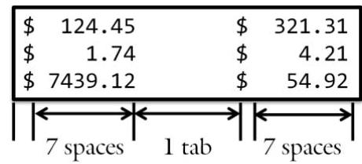
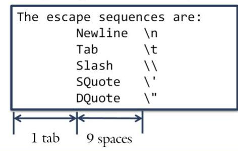

# 1.1 Output {.unit-1-background}


Sam is sitting in the computer lab waiting for class to begin. He is bored, bored, bored! Just for kicks, he decides to dabble in _ASCII-art_. His first attempt is to reproduce his school logo:
```txt
 ____  _  _  __  __     ____
(  _ \( \/ )(  )(  )   (_  _)
 | _ < \  /  )(__)(     _)(_
(____/ (__) (______)   (____)
```

## Objectives

By the end of this class, you will be able to:

- Display text and numbers on the screen.
- Left-align and right-align text.
- Format numbers to a desired number of decimal places.

## Prerequisites

Before reading this section, please make sure you are able to:

- Type the code for a simple program (Chapter 0.2).
- Recite the major parts of a computer program (statements, headers, etc.) (Chapter 0.2).
- Use the provided tools to complete a homework assignment (Chapter 1.0).

## Overview of Output

There are two main methods for a computer to display output on the screen. The first is to draw the output with dots (pixels), lines, and rectangles. This is the dominant output method used in computer programs today. Any windowing operating system (such as Microsoft Windows or Apple Macintosh) favors programs using this method. While this does give the programmer maximum freedom to control what the output looks like, it is also difficult to program. There are dozens of drawing toolsets (OpenGL, DirectX, Win32 to name a few), each of which requires a lot of work to display simple messages.

The second method is to use streams. Streams are, in many ways, like a typewriter. An individual typing on a typewriter only needs to worry about the message that is to appear on the page. The typewriter itself knows how to render each letter and scroll the paper. A programmer using streams to display output specifies the text of the message as well as simple control commands (such as the end of the line, tabs, etc.). The operating system and other tools are left to handle the mechanics of getting the text to render on the screen. We will use stream output exclusively in CS 124.

## `COUT`

As previously discussed, computer programs are much like recipes: consisting of a list of instructions necessary to produce some output. These instructions are called statements. One of the fundamental statements in the C++ language is `cout`: the statement that puts text on the screen. The syntax of `cout` is:

> [!note] `cout` stands for [C]{style="text-decoration: underline;"}onsole _OUT_ put or putting text on the screen. This keyword appears at the beginning of each output statement. 

> [!danger] When displaying generic text, we can write whatever we want as long as we include it in quotes.

[`cout`{.note-style} `<<`{.tip-style} `"CS 124"`{.warning-style} `;`{.success-style}]{.monospace style="background: white; padding: 1em;"}

> [!warning] Following `cout` and separated by a space on each side, the insertion operator (`<<`) indicates that the text on the right-side ("`CS 124`" in this case) is to be sent to the keyword (`cout` in this case) on the left-side. If the insertion operator looks like an arrow, it is not a coincidence; data flows from the right-side ("`CS 124`") to the left-side (the screen or console).

> [!success] The final component of a statement is the semicolon. This is required in all `C++` statements. In many ways, this acts like a period in the English language.

When you put this all together the above statement says "Put the text "`CS 124`" on the screen."

## Displaying Numbers

Up to this point, all of our examples have been displaying text surrounded by double quotes. It is also possible to use cout to display numbers. Before doing this, we need to realize that computers treat integers (numbers without decimals) fundamentally differently than real numbers (numbers with decimals).

We can display an integer by placing the number after an insertion operator in a `cout` statement.
```cpp
cout << 42;
```

Because this number is an integer, it will never be displayed with a decimal. On the other hand, if we are displaying a real number, then we add a decimal in the text:
```cpp
cout << 3.14159;
```

In this example, the computer is not sure how many decimals of accuracy the programmer meant. To be clear on this point, it is useful to include the following code before displaying real numbers:

```cpp
cout.setf(ios::fixed);      // no scientific notation please
cout.setf(ios::showpoint);  // always show the decimal for real numbers
cout.precision(2);          // two digits after the decimal
```

*Please see page 30 for a hint.*

## New Lines

Often the programmer would like to indicate that the end of a line has been reached. With a typewriter, one hits the Carriage Return to jump to the next line; it does not happen automatically. The same is true with stream output. The programmer indicates a newline is needed using two methods:

> [!tip] 
> Both of these mean the same thing:
> 
> | :-- |
> | [cout << ` endl`{.tip-style}]{.monospace} ; |
> | [cout << ` "\n"`{.tip-style}]{.monospace} ; |
> 
> They will output a new line to the screen.

The first method is called endl, short for "end of line." This does not appear in quotes. Whenever a statement is executed with an endl, the cursor jumps down one line and moves to the left. The same occurs when the " `\n` " is encountered. Note that the `\n` must be in quotes. There can be many `\n` 's in a single run of text.
Observe that we have two different ways (endl and `\n`) to do the same thing. Which is best?

|  | [endl]{.monospace} | [\n]{.monospace}  |
| :--
| **Inside quotes**     | [cout << "Hello"; <br> cout << endl;]{.monospace}  | [cout << "Hello\n";]{.monospace} {style="background: #efe"} |
| **Not inside quotes** | [cout << 5; <br> cout << endl;]{.monospace}  | [cout << 5; <br> cout << "\n";]{.monospace} {style="background: #efe"} |
| **Use**               | When the previous item in the output stream is not in quotes, use the `endl`. | Most convenient when you want a newline and are already inside quotes. {.rvhs-green-sidebar-table} |

## The Insertion Operator

As mentioned previously, the insertion operator (`<<`) is the C++ construct that allows the program to indicate which text is to be sent to the screen (through the `cout` keyword). It is also possible to send more than one item to the screen by stacking multiple insertion operators:

```cpp
cout << "I am taking "
     << "CS 124 "
     << "this semester.\n";
```

By convention we typically align the insertion operators so they line up on the screen and are therefore easier to read. However, we may wish to put them in a single line:

```cpp
cout << "I am taking " << "CS 124 " << "this semester.\n";
```

Both of these statements are exactly the same to the compiler; the difference lies in how readable they are to a human. There are three common reasons why one would want to use more than one insertion operator:

| Reason | Example | Explanation |
| :--- | :--- | :--- |
| **Line Limit** | [cout << "I want to make one " <br> $\qquad$ << "very long line much " <br> $\qquad$ << "more manageable.\n";]{.monospace style="display: block; min-width: 2.5in"} | Style checker limits the length of a line to 80 characters. It is often necessary to use multiple insertion operators to keep within this limit. |
| **Mixing** | [cout << "Mix text with " <br> $\qquad$ << 42 << " numbers.\n";]{.monospace} | Variables need to be outside quotes, requiring separate insertion operators for each one. |
| **Comments** | [cout << "CS124" // class <br> $\qquad$ << "-1-" // section <br> $\qquad$ << "Bob"; // prof.]{.monospace} | Comments are more meaningful when they are on the same line as to what they are clarifying. {.rvhs-green-sidebar-table} |

## Alignment

It is often desirable to make output characters align in columns or tables. This is particularly useful when working with columns of numbers. In these cases, we have two tools at our disposal: tabs and set-width.

### Tabs

When the typewriter was invented, it quickly becomes apparent that typists needed a convenient way to align numbers into columns. To this end, the tab key (also known as the tabular key) was invented. The tab key would skip the carriage (or cursor in the computer world) to the next tab stop. In the case of mechanical typewriters, tab stops were set every half inch. This meant that hitting the tab key would move the cursor to the next half inch increment. Sometimes this meant moving forward one space, other times the full half inch. The tab command (`\t`) in cout behaves exactly the same way as a typewriter. Each time the `\t` is encountered in textual data, the cursor moves forward to the next 8 character increment. Consider the following text:

```cpp
cout << "\tOne\n";
cout << "Deux\tDeux\n";
cout << "\t\tTres\n";
```

The output from these statements is:

| --- | --- | --- | --- | --- | --- | --- | --- | --- | --- | --- | --- | --- | --- | --- | --- | --- | --- | --- | --- | ------------- |
|     |     |     |     |     |     |     |     | O   | n   | e   |     |     |     |     |     |     |     |     |     |               |
| D   | e   | u   | x   |     |     |     |     | D   | e   | u   | x   |     |     |     |     |     |     |     |     |               |
|     |     |     |     |     |     |     |     |     |     |     |     |     |     |     |     | T   | r   | e   | s   | {.setw-table} |


Observe how the word "One" is indented eight spaces. This is because the cursor started in the 0 column and, when the tab key was encountered, skipped to the right to the next tab stop (the 8 column).

The first word "Deux" is left aligned because, after the `\n` is encountered in the previous line, the cursor moves down one line and to the 0 column. After the first "Deux", the cursor is on the 3 column. From here the cursor skips to the next multiple of 8 (in this case the 8 column) when the tab is encountered. This makes the "One" and "Deux" left-aligned.

When the third statement is executed, the first tab moves the cursor to the 8 column. The second tab moves the cursor to the next multiple of 8 (the 16 column). From here, the text "Tres" is rendered.

### Set Width

Tabs work great for left-aligning text. However, often one needs to right-align text. This is performed with the set width command. Set width works by counting backwards from a specified numbers of spaces so the next text in the `cout` statement will be right-aligned. Consider the following code:

```cpp
cout << setw(9) << "set\n";
cout << setw(9) << "width\n";
```

The first statement will start at column zero, move 9 spaces to the right (by the number specified in the parentheses), then count to the left by three (the width of the word "set"). This means that the text "set" will start on column 6 ( 9 as specified in the `setw(9)` function minus 3 by the length of the next word). The next statement will again start at column zero (because of the preceding `\n`), move 9 spaces to the right, then count to the left by five (the width of the word "width"). This means that the text "width" will start on column 4 ( 9 minus 5). As a result, the two words will be right-aligned.

| --- | --- | --- | --- | --- | --- | --- | --- | --- | --- | --- | --- | --- | --- | --- | --- | --- | --- | --- | --- | ------------- |
|     |     |     |     |     |     | s   | e   | t   |     |     |     |     |     |     |     |     |     |     |     |               |
|     |     |     |     | w   | i   | d   | t   | h   |     |     |     |     |     |     |     |     |     |     |     | {.setw-table} |

One final note: the `setw()` function is in a different library which needs to be included. You must `#include` the `iomanip` library:

```cpp
#include <iomanip>
```

It turns out that there are many other formatting options available to programmers. You can output your numbers in hexadecimal, unset formatting flags, and pad with periods rather than spaces. Please see the following for a complete list of the options:
[http://en.cppreference.com/w/cpp/io/ios_base](http://en.cppreference.com/w/cpp/io/ios_base).

### Using Tabs and Set Width Together

Tabs and set width are commonly used together when displaying columns of figures such as money. Consider the following code:

```cpp
#include <iostream> // required for COUT
#include <iomanip>  // we will use setw() in this example
using namespace std;
int main()
{
    // configure the output to display money
    cout.setf(ios::fixed);     // no scientific notation except for the deficit
    cout.setf(ios::showpoint); // always show the decimal point
    cout.precision(2);         // two decimals for cents; this is not a gas station!
    // display the columns of numbers
    cout << "\t$" << setw(10) << 43.12 << endl;
    cout << "\t$" << setw(10) << 115.2 << endl;
    cout << "\t$" << setw(10) << 83299.3051 << endl;
    return 0;
}
```

In this example, the output is:

```
        $     43.12
        $    115.20
        $  83288.31
```

Observe how the second row displays two decimals even though the code only has one. This is because of the `cout.precision(2)` statement indicating that two decimals will always be used. The third row also displays two decimal places, rounding the number up because the digit in the third decimal place is a 5 .

> [!DANGER] 💡 **Sue's Tip:**
> {.sue}
> It is helpful to first draw out the output on graph paper so you can get the column widths correct the first time. When the output is complex (as it is for Project 1), aligning columns can become frustrating.

### Special Characters

As mentioned previously, we always encapsulate text in quotes when using a `cout` statement:
```cpp
`cout << "Always use quotes around text\n";`
```

There is a problem, however, when you actually want to put the quote mark (") in textual output. We have the same problem if you want to put the backslash `\` in textual output. The problem arises because, whenever `cout` sees the backslash in the output text, it looks to the next character for instructions. These instructions are called escape sequences. Escape sequences are simply indications to `cout` that the next character in the output stream is special. We have already seen escape sequences in the form of the newline (`\n`) and the tab (`\t`). So, back to our original question: how do you display the quote mark without the text being ended and how do you display `\n` without a newline appearing on the screen? The answer is to escape them:
```cpp
`cout << "quote mark:\" newline: \\n" << endl;`
```
When the first backslash is encountered, `cout` goes into "escape mode" and looks at the next character. Since the next character is a quote mark, it is treated as a quote in the output rather than the marker for the end of the text. Similarly, when the next backslash is encountered after the newline text, the next backslash is treated as a backlash in the output rather than as another character. The output of the code would be:
```cpp
`quote mark:" newline: \n`
```

Up to this point, the following are the escape sequences we can use:

| Name | Character {.row-border} |
| :--- | :--- |
| New Line | `\n` |
| Tab | `\t` |
| Backslash | `\\` |
| Double Quote | `\"` |
| Single Quote | `\'` {.rvhs-green-sidebar-table} |

There are many other lesser known and seldom used escape characters as well:
[https://msdn.microsoft.com/en-us/library/h21280bw.aspx](https://msdn.microsoft.com/en-us/library/h21280bw.aspx)

> [!success] Example
>
> ## Example 1.1 - Money Alignment
>
> ### Demo
>
> [This example will demonstrate how to use tabs and `setw()` to align money. This is important in Assignment 1.1, Project 1, and many output scenarios.]{style="display: block; min-height: 1in"}
>
> ---
>
> ### Problem
>
> Write a program to output a list of numbers on a grid:\
>
> 
>
> ---
>
> ### Solution
>
> The first part of the solution is to realize that all the numbers are displayed as money. This requires us to format `cout` to display two digits of accuracy.
>
> ```cpp
> cout.setf(ios::fixed);
> cout.setf(ios::showpoint);
> cout.precision(2);
> ```
>
> After the leading `$` the text is right-aligned to seven spaces. This will require code something like:
>
> ```cpp
> cout << "$" << setw(7) << 124.45; // numbers not in quotes!
> ```
>
> Following the first set numbers, we have another column separated by a tab.
>
> ```cpp
> cout << "\t";
> ```
>
> Next, another column of numbers just like the first.
>
> ```cpp
> cout << "$" << setw(7) << 321.31; // again, the numbers are not in quotes
> ```
>
> Finally, we end with a newline
>
> ```cpp
> cout << endl; // instead, we could say "\n"
> ```
>
> Put it all together:
>
> ```cpp
> // display the first row
> cout << "$"
>      << setw(7) << 124.45
>      << "\t$"
>      << setw(7) << 321.31
>      << endl;
> ```
>
> ---
>
> ### Challenge
>
> As a challenge, try to increase the width of each column from 7 spaces to 10 . How does this change the space between columns? Can you add a third column of numbers?
>
> Finally, what is the biggest number you can put in a column before things start to get "weird." What happens when the numbers are wider than the columns?
>
> ---
>
> ### See Also
>
> The complete solution is available at `1-1-alignMoney.cpp` or:
> `/home/cs124/examples/1-1-alignMoney.cpp`{style="display: block; min-height: 1in"}

> [!success] Example
>
> ## Example 1.1 - Escape Sequences
>
> ### Demo
>
> [This example will demonstrate how to display special characters on the screen using escape sequences. Not only will we use escape sequences to get tabs and newlines on the screen, but we will use escapes to display characters that are normally treated as special.]{style="display: block; min-height: .8in"}
>
> ---
>
> ### Problem
>
> Write a program to display all the escape sequences in an easy-to-read grid.
>
> 
>
> ---
>
> ### Solution
>
> We need to start by noting that there are six lines in the output so we should expect to use six `\n` escape sequences. If we do not end each line with a newline, then all the text will run onto a single line.
> Next, there needs to be a tab before each of the five lines in the list. This will be accomplished with a `\t` escape sequence. Each of the slashes in the escape sequence will need to be escaped. Consider the following code:
> `cout << "\tNewline \n\n";`
>
> This will result in the following output:
>
> ```
>       Newline
>
> ```
>
> Notice how the `\n` was never displayed and we have an extra blank line. Instead, the following will be necessary:
> `cout << "\tNewline \\n\n";`
>
> Here, after the "Newline" text, the first `\` will indicate that the second is not be treated as an escape. The end result will display a `\` on the screen. Next the `n` will be encountered and displayed. The final `\` will indicate the following character is to be treated special. That character, the `n` will be interpreted as a newline.
>
> ---
>
> ### Challenge
>
> [The final challenge is the double quote at the end of the sequence. It, tool, will need to be escaped or the compiler will think we are ending a string.]{style="display: block; min-height: 1in"}
>
> ---
>
> ### See Also
>
> As a challenge, try to reverse the order of the text so the escape appears before the label. Then try to right-align the label using `setw()`:
>
> ```txt
>       \n    Newline
>       \t        Tab
> ```
>
> The complete solution is available at `1-1-escapeSequence.cpp` or:
> `/home/cs124/examples/1-1-escapeSequence.cpp`


> ## Problem 1
>
> Write the code to put a newline on the screen.
>
> **Answer:**
>
> <input>

> ## Problem 2
>
> How do you right-align numbers in C++?
>
> ```txt
>   5
> 555
> ```
>
> **Answer:**
>
> <input>
> 

> ## Problem 3
>
> If the tab stops are set to 8 spaces, what will be the output of the following code?
>
> ```cpp
> cout << "123\t456\n";
> cout << "1234567\t8\n";
> ```
>
> **Answer:**
>
> <input>
> 

> ## Problem 4
>
> Write the code to generate the following output:
> ```
> /\/\/\
> \/\/\/
> ```
> **Answer:**
>
> <input>
> 

> ## Problem 5
>
> What is the output of the following code?
> ```cpp
> cout << "\t1\t2\t3\n\t4\t5\t6\n\t7\t8\t9\n";
> ```
>
> **Answer:**
>
> <input>


> ## Problem 6
>
> Write a program to put the following text on the screen:
> ```
> I am taking
>     "CS 124"
> ```
> Note that there is a tab at the start of the second line.
>
> **Answer:**
>
> <input>


> ## Problem 7
>
> Write the code to generate the following output:
> ```
> Bill:
> $  10.00 - Price
> $   1.50 - Tip
> $  11.50 - Total
> ```
>
> **Answer:**
>
> <input>


> [!Success] Assignment
>
> ## Assignment 1.1
>
> Write a program to output your monthly budget:
>
> | Item | Projected |
> | --- | ---: |
> | Income| $1000.00 |
> | Taxes | $100.00 |
> | Tithing | $100.00 |
> | Living | $650.00 |
> | Other  {style="min-width: 1.5in;"} | $90.00 {.rvhs-green-header-table} |
>
> ---
>
> ### Example
>
> ```
>        Item           Projected
>        =============  ==========
>        Income         $  1000.00
>        Taxes          $   100.00
>        Tithing        $   100.00
>        Living         $   650.00
>        Other          $    90.00
>        =============  ==========
>        Delta          $    60.00
> ```
>
> ---
>
> ### Instructions
>
> Please note:
>
> - There is a single tab at the start of each line, but nowhere else.
> - There are 13 `=`'s in the first column, 10 in the second. There are 2 spaces between the columns.
> - The spacing between the `$` and the right edge of the money is 9.
> - You will need to set the formatting of the prices with the `precision()` command.
> - Please display the money as a number, rather than as text. This means two things. First, the numbers should be outside > the quotes (again, see the example above). Second, you will need to use the `setw()` function to get the numbers to line up > correctly.
> - Please verify your solution against:
> `testBed cs124/assign11 assignment11.cpp`
> - Don't forget to submit your assignment with the name "Assignment 11" in the header.
