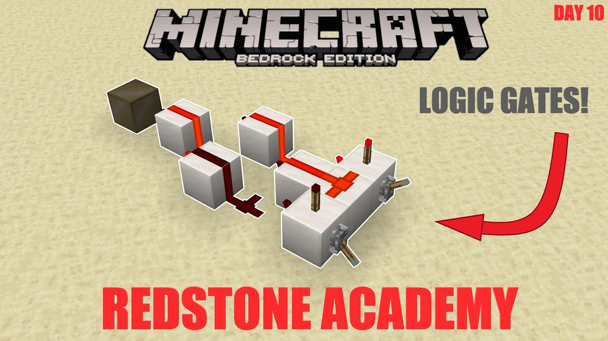
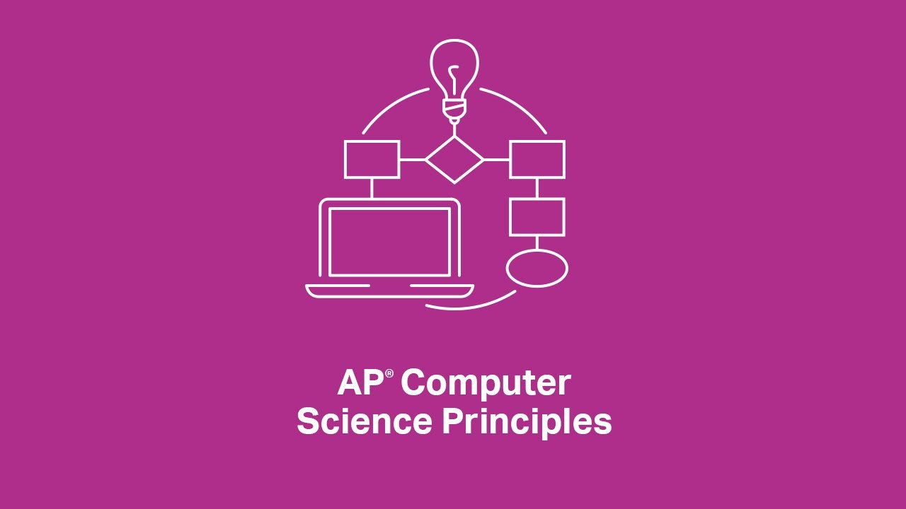
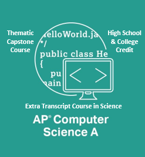
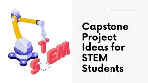
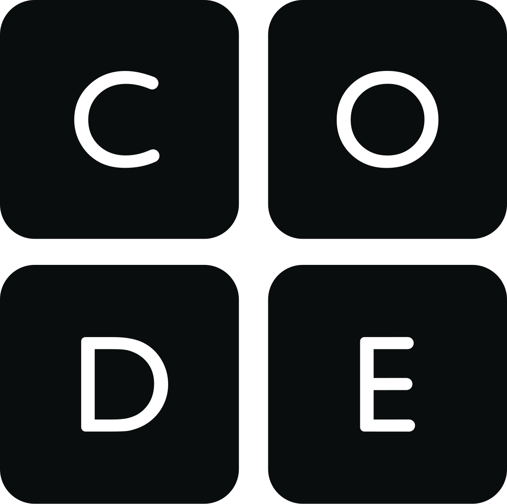

<table>
    <tr>
        <td valign="top" width="50%" style="padding-top: 40px">

# Mr. Eli

**Room 908**  
**eliharrison@ycusd.org**

---

## Courses Taught
- **AP Computer Science Principles**
- **AP Computer Science A**
- **Career Expo**
- **STEM Capstone**

---

{height=200} {height=200} {height=200}

</td>
<td valign="top" width="50%">

## What We Do
- Build real-world apps and games
- Learn to code in Java, Python, and more
- Explore cybersecurity, AI, and data science
- Compete in coding challenges
- Collaborate on creative STEM projects
- Prepare for tech careers and college
- Learn logic circuits in Minecraft!

## Fun Facts
- No experience needed—just curiosity!
- Guest speakers from the industry

---

{height=200} {height=200}

---

# Join us and discover what you can create!

</td>
    </tr>
</table>